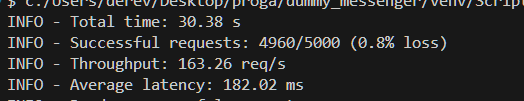
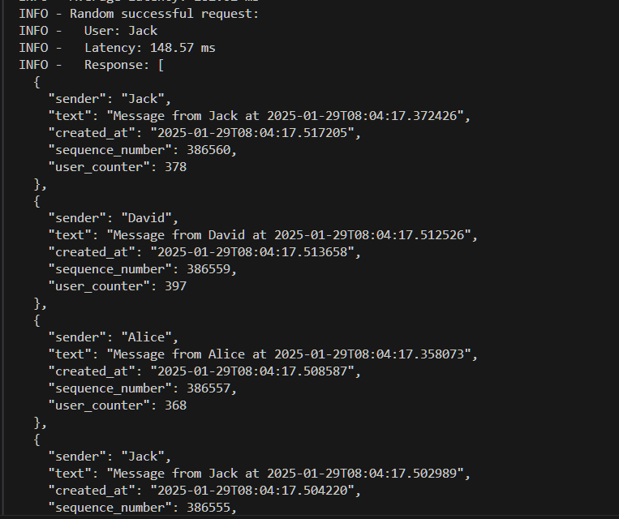

# Запуск проекта

Следуйте этим шагам для запуска проекта:

1. Клонируйте репозиторий:
    ```sh
    git clone <URL репозитория>
    ```

2. Перейдите в директорию проекта:
    ```sh
    cd dummy_messenger
    ```

3. Создайте виртуальное окружение:
    ```sh
    python -m venv venv
    ```

4. Активируйте виртуальное окружение:
    ```sh
    source venv/Scripts/activate
    ```

5. Установите зависимости:
    ```sh
    pip install -r requirements.txt
    ```

6. Запустите Docker Compose:
    ```sh
    docker compose up --build
    ```

7. Выполните миграции базы данных:
    ```sh
    docker exec -it dummy_messenger_tz-server1-1 alembic upgrade head
    ```

8. Запустите клиент:
    ```sh
    python client.py
    ```

## Данные для подключения к БД через DBeaver/pgAdmin
- **Пользователь**: postgres
- **Пароль**: postgres
- **Название**: dummy_messenger
- **Порт**: 5433
- **Хост**: localhost

# Пример полученных результатов

## Пропускная способность


## Результат случайного запроса
